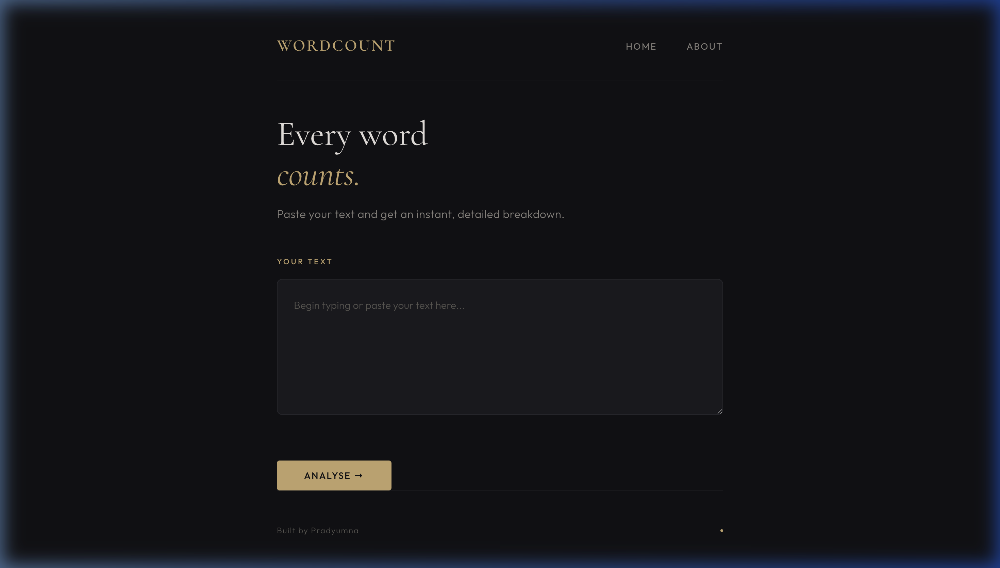
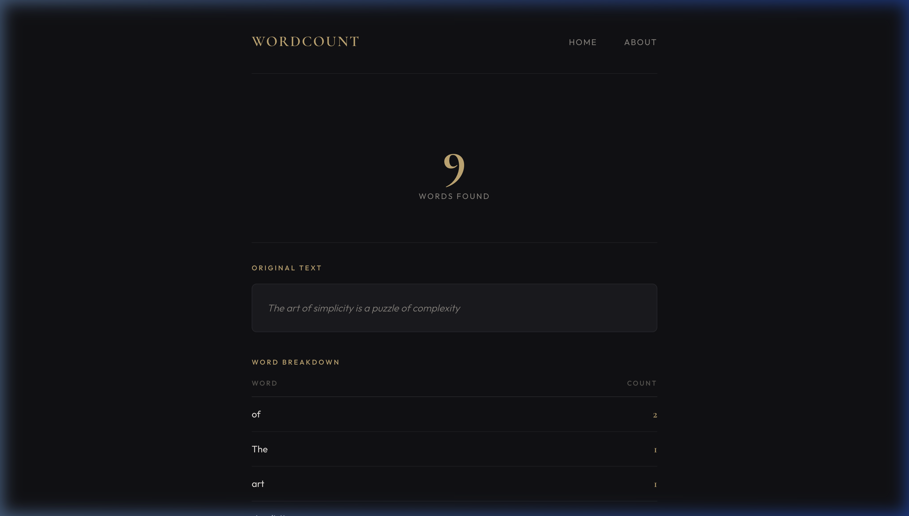

# WordCount

A clean, elegant word counting tool built with Django. Paste in any text and get an instant breakdown of every word and its frequency.

## Features

- **Instant word count** — paste text and get total word count immediately
- **Word frequency breakdown** — see every unique word sorted by frequency
- **Sophisticated UI** — dark charcoal theme with warm gold accents, elegant serif typography (Cormorant Garamond), and refined layout details

## Screenshots

### Home Page


### Results Page


## Tech Stack

- **Backend**: Python, Django
- **Frontend**: HTML, CSS (vanilla)
- **Fonts**: [Cormorant Garamond](https://fonts.google.com/specimen/Cormorant+Garamond), [Outfit](https://fonts.google.com/specimen/Outfit)

## Getting Started

### Prerequisites

- Python 3.x
- pip

### Installation

1. Clone the repository:
   ```bash
   git clone https://github.com/pradyumnakr/wordcount-project.git
   cd wordcount-project
   ```

2. Install dependencies:
   ```bash
   pip install django
   ```

3. Run the development server:
   ```bash
   python manage.py runserver
   ```

4. Open [http://127.0.0.1:8000](http://127.0.0.1:8000) in your browser.

## Project Structure

```
wordcount-project/
├── manage.py
├── static/
│   └── css/
│       └── style.css        # All styling
├── templates/
│   ├── base.html            # Base layout
│   ├── home.html            # Home / input page
│   ├── count.html           # Results page
│   └── about.html           # About page
└── wordcount/
    ├── settings.py
    ├── urls.py
    └── views.py
```

## Author

**Pradyumna**

## License

This project is open source.
